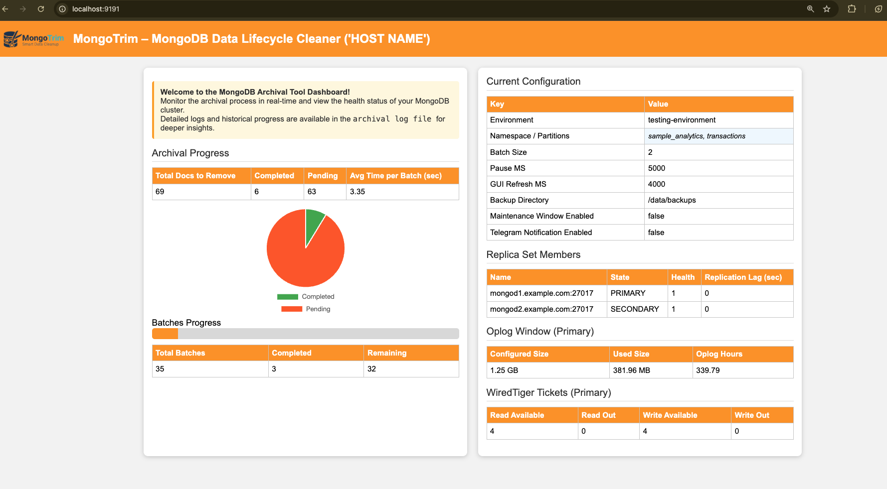

# 📦 MongoTrim — Intelligent MongoDB Data Ageing & Archival Tool
A precision-controlled, automated lifecycle manager for MongoDB with selective freezing, trimming, archival, safety validation, and optional GUI monitoring.

---

## 🚀 Overview
MongoTrim - MongoDB Archival Tool is a Node.js CLI + GUI utility designed to safely archive large MongoDB collections in controlled batches.  
It prevents performance impact, supports automated maintenance windows, provides real-time monitoring, and ensures fully auditable operations.

This tool is ideal for:
- Production clusters  
- Time-series or log collections  
- Compliance-driven retention cleanup  
- Daily/weekly scheduled maintenance  
- Safe batch-wise deletions  

---

## ✨ Features

### ✔ Batch-wise Archival  
- Configurable batch size  
- Delay between batches  
- Predictable deletion (sorted by `_id: 1`)  

### ✔ Backup Options  
- **Batch Backup:** One backup per batch  
- **Full Backup:** One full snapshot before deletion  
- Optional — fully config-driven  

### ✔ Maintenance Window  
- Optional start/end window  
- Auto-stop outside window  
- Prevents accidental day-time archival  

### ✔ Real-Time GUI Dashboard  
- Batch progress  
- Total documents & batch count  
- Deleted count  
- Backup files  
- ETA calculation  
- Config summary  
- MongoDB health  
Powered by small Express server using:  
`progress.json`, `current_config.json`, `mongo_health.json`.

### ✔ Pre-Validation (Dry Run)  
Tool validates:
- Mongo connection  
- Database & collection  
- Filter  
- Count of documents  
- Estimated batches  
- Disk space (>20% required)  
- Backup directories  

### ✔ Rich Logging  
- `archive.log` (line-delimited JSON)  
- `progress.json` (live progress)  
- `current_config.json` (snapshot)  
- `mongo_health.json`  
- `guiStats.log`  

### ✔ Telegram Alerts (optional)
- Start alert  
- Stop alert  
- Periodic interval updates  
- Backup summary  

---

## 📁 Directory Structure
```
mongodb-archival-tool/
│
├── config/
│   └── config.yaml
│
├── lib/
│   ├── configLoader.js
│   ├── logger.js
│   ├── validator.js
│   ├── backup.js
│   ├── mongoRunner.js
│   ├── util.js
│   ├── notifier.js
│   ├── telegramTemplates.js
│   ├── help.js
│   └── logoDisplay.js
│
├── server/
│   ├── gui.js
│   ├── guiLogger.js
│   └── mongoHealth.js
│
├── logs/
│   ├── archive.log
│   ├── progress.json
│   ├── current_config.json
│   ├── mongo_health.json
│   └── guiStats.log
│
├── index.js
├── package.json
└── README.md
```

---

## ⚙️ Configuration (config.yaml)

### Example Config File

```
paths:
  base_dir: "/home/ec2-user/MongoDB_Archival_Tool/mongodb-archival-tool"  # Where the tool is places the parnet folder

mongodb:
  uri: "mongodb://<usser>:<pwd>@localhost:27017/?authSource=admin"
  # namespace can be either an array ["db","collection"] OR a string "db.collection"
  namespace: ["sample_analytics", "transactions"]
  # Keep the query as a string (JSON)mkdir -p config lib server logs
  env: "testing-environment" # Host Name of IP or Environment name for identification
  filter: '{ "transaction_count": { "$lt": 20 } }'

archival:
  batch_size: 2 
  pause_ms: 5000 # Default is 5 Sec (i.e 5000 ms)

maintenance_window:
  enabled: false
  end: "2025-11-28T16:02:00"

backup:
  enabled: true
 # gzip: true
  type: "fullQuery"               # "batch" | "fullQuery"
  dest_dir: "/data/backups"   # absolute path

gui:
  enabled: true
  host: "127.0.0.1"
  port: 9191
  refresh_interval_ms: 4000

log:
  file: "logs/archive.log"


notification:
  telegram:
    enabled: true
    bot_token: "123456XXXXX:AAAAAAAAAAAYJiGUz26rp-A1234567a890"
    chat_id: "-XXXXXX"

```

### 🔧 Required Fields
| Field | Description |
|-------|-------------|
| `mongodb.uri` | MongoDB connection string |
| `mongodb.namespace` | NameSpace | 
| `mongodb.filter` | MongoDB query for archival |
| `archival.batch_size` | Number of docs per batch |
| `backup.enabled` | Enable/Disable backups |
| `gui.enabled` | Start GUI server |

### 🧩 Optional Fields
- `backup.type: batch | fullQuery`
- `backup.dest_dir: ` 
- `maintenance.end`  
- `archival.pause_ms` → sleep between batches  
- `telegram.enabled: true|false`  
- `telegram.token`  
- `telegram.chat_id`  
- `backup.dest_dir`  
- `log.file`  

### ⚠️ Config Restrictions
- `archival.batch_size` must be > 0 
- Filters must not be empty unless explicitly confirmed  
- Backup directory must exist  
- Disk space must be > 10% free (validated automatically)  

---

## ▶️ Usage

### Tool Installation and Configuration

```
git clone https://github.com/MadhuSai-Vavilala/Mongodb_Archival_Tool.git

cd Mongodb_Archival_Tool

unzip mongodb-archival-tool.zip

pwd

# Now update the "paths.base_dir" with the current folder or update other configurations. 
```

### 🔍 1. Dry Run (Validation Only)
```
node index.js --dryRun
```

### 🗑️ 2. Start Archival
```
node index.js
```
### CLI


---

## 📊 GUI Summary
Runs at:
```
http://localhost:<gui_port>
```

Displays:
- Live archival progress  
- Average Batch Processing Time 
- Batch number  
- Deleted docs  
- Total docs
- Pi Chart for the Document's process
- Bar chat for the batch count for the process    
- Config summary  
- MongoDB health stats
  - Replication Lag
  - Oplog Size and Oplog Window
  - WiredTiger Tickets

### GUI


---

## 📦 Backup Output
Depending on the mode:

### **Batch Backup**
```
backup/
   archive_batch_1_<EPOCH Time>/<db>/<coll>.bson.gz
   archive_batch_2_<EPOCH Time>/<db>/<coll>.bson.gz
   ...
```

### **Full Backup**
```
backup/
   archive_fullQuery_backup_<timestamp>/<db>/<collection>.bson.gz
```

---

## 🔒 Safety Mechanisms
- Auto-stop outside maintenance window  
- Disk space validation (>10%)
- Backup Folder File permissions  
- MongoDB connectivity checks  
- Write-permission checks  
- Sanitised logging  
- No destructive operation without validation  

---

## 🤖 CLI Arguments
```
--config <config> Run with a new Config file
--dry-run    Validate only
--help       Show help
```

## ⚡ Performance & Safety Recommendations

> These guidelines will help ensure stable archival execution on production MongoDB clusters without causing performance degradation, replication issues, or resource pressure.

---

### 💤 1. Tune Sleep Time Between Batches
- Reducing `archival.pause_ms` speeds up archival but increases cluster load.
- If sleep time is too low, the tool may issue rapid delete operations, which can:
  - Consume the oplog aggressively
  - Create high replication lag
  - Push secondaries temporarily out of sync
- For production systems, keep a **balanced sleep interval** to avoid overwhelming the cluster.

---

### 📦 2. Choose the Correct Backup Mode
The tool supports two backup strategies:

#### **Full Backup Mode**
- Takes a complete backup of all documents **before archival starts**.
- Recommended when you want a single consistent snapshot.
- Best used when backup time is not critical.

#### **Batch Backup Mode**
- Backs up each batch **immediately before deletion**.
- Highly recommended for **write-heavy or high-throughput clusters** because it:
  - Avoids large I/O spikes from full backup
  - Reduces system load
  - Keeps both primary and replicas stable

---

### 📉 3. Use Smaller Batch Sizes
- Avoid using very large batch sizes — they cause:
  - Sudden spikes in I/O and deletion load
  - Increased locking and replication stress
  - Slower performance for other workloads
- Prefer **small, consistent batches** for smooth and safe archival.

---

### ⚠️ 4. Monitor Replication & Oplog Usage
During archival:
- Fast deletions can shrink the oplog window if write traffic is also high.
- Always ensure:
  - Replication lag remains within safe limits
  - Oplog window is not shrinking rapidly
  - Secondaries remain in `SECONDARY` and do not fall into `RECOVERING`

---

### 🧪 5. Always Run a Dry Run First
Before starting a real archival run:
- Validate your filter
- Validate document count
- Check estimated batch count
- Confirm backup directory and disk space
- Ensure MongoDB connectivity and namespace correctness

A dry run provides full clarity and avoids mistakes in production.

---

### 📝 Summary
For production safety:

- ✔ Keep batch sizes small  
- ✔ Use a reasonable delay between batches  
- ✔ Use Batch Backup mode for high-write clusters  
- ✔ Run a dry run before actual archival  
- ✔ Monitor replication and oplog during execution  

These recommendations ensure the archival tool runs smoothly, safely, and without affecting production workload.

## Important Notes

- **Architecture Support:**  
  This tool is designed to work on **all MongoDB architectures** — Standalone, Sharded Clusters, and Replica Sets.

- **GUI Limitation:**  
  The **Archival Status** view in the GUI currently supports **Replica Sets only**.  
  If you are using **Standalone** or **Sharded** deployments and face GUI-related issues, you may **disable/comment out the GUI** section in your code.

- **Having Issues?**  
  If you face any problems, feel free to report them to:  
  **vavilalamadhusai80@gamil.com**

- Note: I added the Percona logo in the GUI for design purposes, but this was done independently and not officially approved by Percona.

---

## 👨‍💻 Author
Madhu Sai — Database Engineer  
Designed with a focus on reliability & production safety.
